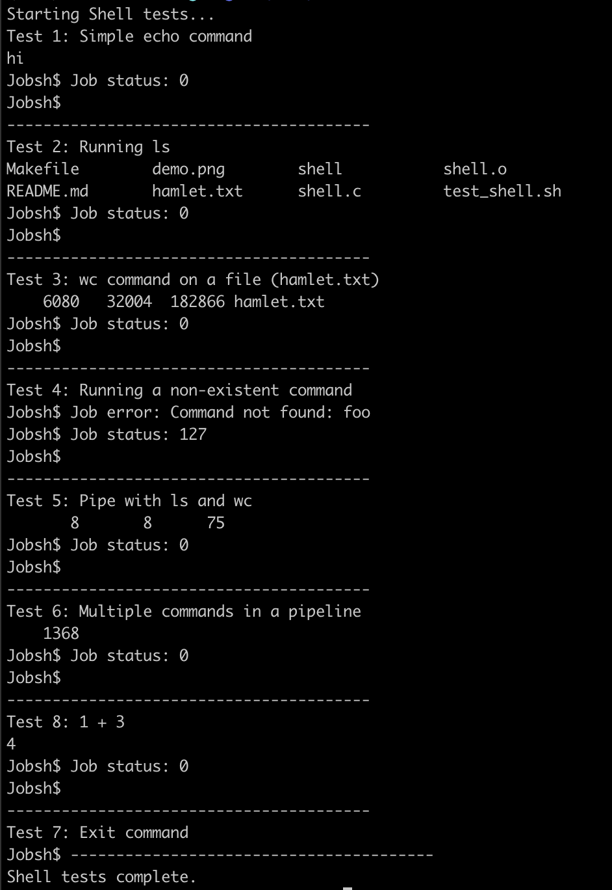

# Jobsh - A Custom Linux Shell Application
## Overview

Jobsh is a Unix-like interactive shell built in C. It supports executing commands with or without arguments, providing process management, error handling, and command chaining using pipes. This project demonstrates a simplified version of a Linux shell, allowing users to interact with their operating system through command-line inputs.

## Features

* Execute Commands: Run basic Linux commands like ls, wc, and echo.
* Command Status: Displays the exit status of each command after execution.
* Error Handling: Provides meaningful error messages for invalid commands or arguments.
* Chaining Commands (Piping): Allows execution of multiple commands connected by pipes `|`.
* Graceful Exit: Use the exit command to terminate the shell.

### Run the program

- Compile the program with provided `Makefile`.
- Alternatively, run `gcc -o shell shell.c`

### Interface
- Run the shell:
`./shell`
- Enter commands interactively. Use exit to quit.
- Sample Commands and Outputs

1. Basic Command Execution

    `Jobsh$ ls -l`

    `Jobsh$ bc`

2. Error Handling
    
    `Jobsh$ ls nosuchfile`

6. Processes Pipling Concurrently

    `Jobsh$ cat hamlet.txt | grep "the" | wc -l`

## Implementation details 

- Memory Management: Prevents zombie processes by ensuring all child processes are properly waited for and terminated.

- Performance Optimization: Executes each command or pipeline segment in its own child process concurrently, reducing overall execution time.

- System Management: Leverages system calls such as `fork()`, `execvp()`, `dup2()`, `pipe()`, and `waitpid()` to interact with the OS kernel for process creation, I/O redirection, and inter-process communication.

## Result Display

## Future Improvements

Add support for other operators, like redirection (>, <, <<, >>), command substitution ($).
Implement job control (& for background processes).
Enhance error handling for edge cases.